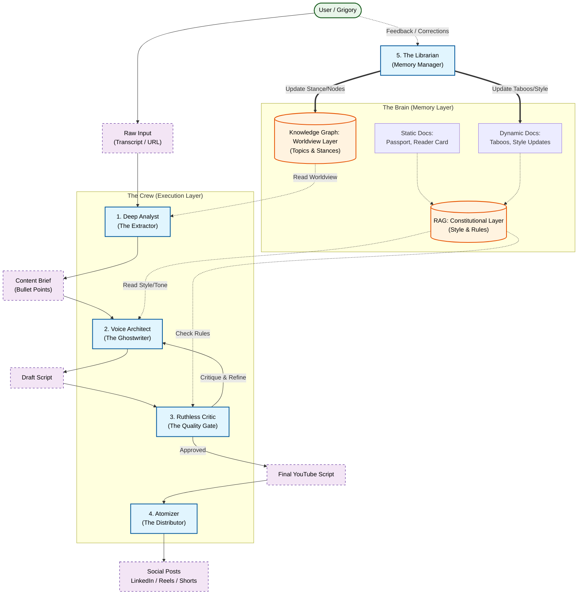

```mermaid
flowchart TB
    %% --- STYLING ---
    classDef agent fill:#e1f5fe,stroke:#01579b,stroke-width:2px,color:#000000
    classDef memory fill:#fff3e0,stroke:#e65100,stroke-width:2px,color:#000000
    classDef artifact fill:#f3e5f5,stroke:#4a148c,stroke-width:1px,stroke-dasharray: 5 5,color:#000000
    classDef user fill:#e8f5e9,stroke:#1b5e20,stroke-width:2px,color:#000000

    %% --- ACTORS & INPUTS ---
    User(["User / Grigory"]):::user
    Input["Raw Input<br/>(Transcript / URL)"]:::artifact

    %% --- THE BRAIN (MEMORY) ---
    subgraph Brain ["The Brain (Memory Layer)"]
        direction TB
        RAG[("RAG: Constitutional Layer<br/>(Style & Rules)")]:::memory
        KG[("Knowledge Graph: Worldview Layer<br/>(Topics & Stances)")]:::memory
        
        %% Static vs Dynamic RAG content
        StaticDocs["Static Docs:<br/>Passport, Reader Card"]-.->RAG
        DynamicDocs["Dynamic Docs:<br/>Taboos, Style Updates"]-.->RAG
    end

    %% --- THE CREW (EXECUTION) ---
    subgraph Crew ["The Crew (Execution Layer)"]
        direction TB
        
        Analyst["1. Deep Analyst<br/>(The Extractor)"]:::agent
        Writer["2. Voice Architect<br/>(The Ghostwriter)"]:::agent
        Critic["3. Ruthless Critic<br/>(The Quality Gate)"]:::agent
        Atomizer["4. Atomizer<br/>(The Distributor)"]:::agent
    end

    %% --- THE LEARNING LOOP ---
    Librarian["5. The Librarian<br/>(Memory Manager)"]:::agent

    %% --- FLOW CONNECTIONS ---
    
    %% 1. Ingestion & Analysis
    User --> Input
    Input --> Analyst
    KG -.->|"Read Worldview"| Analyst
    Analyst --> Brief["Content Brief<br/>(Bullet Points)"]:::artifact
    
    %% 2. Drafting
    Brief --> Writer
    RAG -.->|"Read Style/Tone"| Writer
    Writer --> Draft["Draft Script"]:::artifact
    
    %% 3. Critique Loop
    Draft --> Critic
    RAG -.->|"Check Rules"| Critic
    Critic -->|"Critique & Refine"| Writer
    
    %% 4. Final Output & Atomization
    Critic -->|"Approved"| FinalScript["Final YouTube Script"]:::artifact
    FinalScript --> Atomizer
    Atomizer --> Socials["Social Posts<br/>LinkedIn / Reels / Shorts"]:::artifact
    
    %% 5. THE FEEDBACK LOOP (LIBRARIAN)
    User -.->|"Feedback / Corrections"| Librarian
    Librarian ==>|"Update Taboos/Style"| DynamicDocs
    Librarian ==>|"Update Stance/Nodes"| KG
```