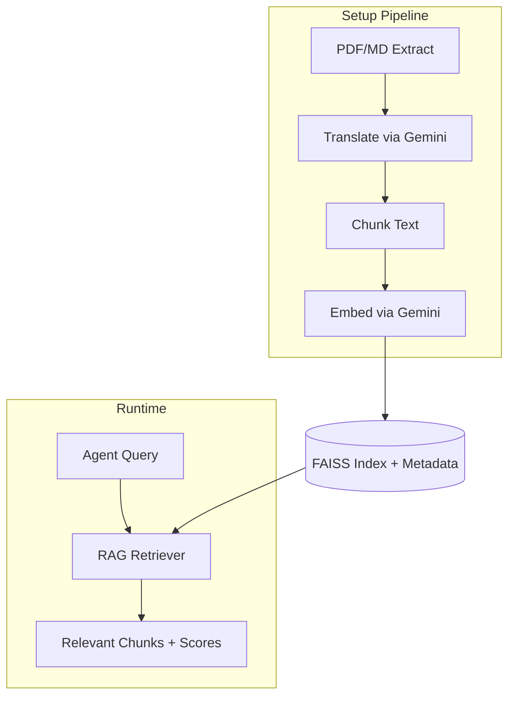

# RAG Constitutional Layer

The RAG (Retrieval-Augmented Generation) Constitutional Layer stores and retrieves brand voice, tone, and style rules using FAISS vector search with Gemini embeddings.

## Overview

This layer serves as the "style memory" for the Pragmatic Content Factory. It indexes:

- **Static documents** (`data/static/`) - Brand DNA, reader profiles, speech codes (PDFs)
- **Dynamic documents** (`data/dynamic/`) - Taboo lists, style adjustments (Markdown)

Agents like **Voice Architect** and **Ruthless Critic** query this layer to ensure content aligns with brand guidelines.

## Architecture



## Quick Start

### 1. Configure

Edit `conf/rag_config.yaml` to adjust chunking and embedding settings:

```yaml
chunking:
  chunk_size: 500      # tokens per chunk
  chunk_overlap: 50    # overlap between chunks

embedding:
  model: "text-embedding-004"
  batch_size: 10
```

### 2. Build the Index

```bash
# From project root
cd pragmatic_content_factory

# Check what would be indexed (dry run)
python -m setup.seed_rag_index --check

# Build the index
python -m setup.seed_rag_index

# Force rebuild (ignore cache)
python -m setup.seed_rag_index --force
```

### 3. Use in Code

**For ADK Agents** - use the tools module:

```python
from pragmatic_content_factory.tools import query_style_rules, query_taboos

# In agent definition
agent = Agent(
    name="voice_architect",
    tools=[query_style_rules, query_taboos],
    ...
)
```

**For direct Python use**:

```python
from pragmatic_content_factory.memory.rag import get_retriever, retrieve

# Option 1: Use the convenience function
result = await retrieve("voice tone guidelines", top_k=5)
print(result.format_context())

# Option 2: Get retriever instance for more control
retriever = await get_retriever()
result = await retriever.retrieve("taboo terms to avoid", top_k=3)

for chunk, score in zip(result.chunks, result.scores):
    print(f"[{score:.3f}] {chunk.source_file}: {chunk.text[:100]}...")
```

## Module Structure

```
memory/rag/
├── __init__.py      # Public exports
├── models.py        # Pydantic models (RAGConfig, DocumentChunk, etc.)
├── indexer.py       # FAISS index creation and management
├── retriever.py     # Query interface for agents
└── README.md        # This file
```

## Key Components

### Models (`models.py`)

| Model | Purpose |
|-------|---------|
| `RAGConfig` | Configuration loaded from `conf/rag_config.yaml` |
| `DocumentChunk` | A chunk of indexed text with metadata |
| `IndexManifest` | Tracks indexed documents for incremental updates |
| `RetrievalResult` | Query results with chunks and similarity scores |

### Indexer (`indexer.py`)

- Generates Gemini embeddings (`text-embedding-004`, 768 dimensions)
- Builds FAISS index with inner product similarity (cosine after normalization)
- Persists index to `data/faiss_index/`
- Tracks document hashes for smart incremental updates

### Retriever (`retriever.py`)

- Singleton pattern for efficient reuse across agents
- Async interface: `await retriever.retrieve(query, top_k=5)`
- Convenience methods: `get_style_rules()`, `get_taboo_terms()`

### Agent Tools (`tools/rag_tools.py`)

ADK-compatible function tools that wrap the retriever:

| Tool | Purpose | Used By |
|------|---------|---------|
| `query_style_rules` | Get style rules and voice guidelines | Voice Architect |
| `query_taboos` | Check against taboo/prohibited terms | Ruthless Critic |
| `query_brand_voice` | Get brand persona guidelines | Voice Architect |

## Smart Incremental Indexing

The index is only rebuilt when necessary:

1. **Config changed** - `conf/rag_config.yaml` was modified
2. **New documents** - Files added to `data/static/` or `data/dynamic/`
3. **Modified documents** - Existing files changed (MD5 hash differs)
4. **Removed documents** - Files deleted from source directories

Check what would trigger a rebuild:

```bash
python -m setup.seed_rag_index --check
```

## Data Files

| Path | Contents |
|------|----------|
| `data/faiss_index/pcf-constitutional.index` | FAISS vector index |
| `data/faiss_index/pcf-constitutional.metadata.json` | Chunk metadata |
| `data/faiss_index/index_manifest.json` | Document tracking for incremental updates |

## Environment Variables

```bash
GOOGLE_API_KEY=xxx  # Required for Gemini embeddings
```

## Troubleshooting

### "Index not found" warning
Run `python -m setup.seed_rag_index` to build the index first.

### Stale results after document changes
The index should auto-detect changes. If not, force rebuild:
```bash
python -m setup.seed_rag_index --force
```

### Translation issues
Documents in non-English languages are auto-translated using Gemini. Check logs for translation errors if results seem off.

