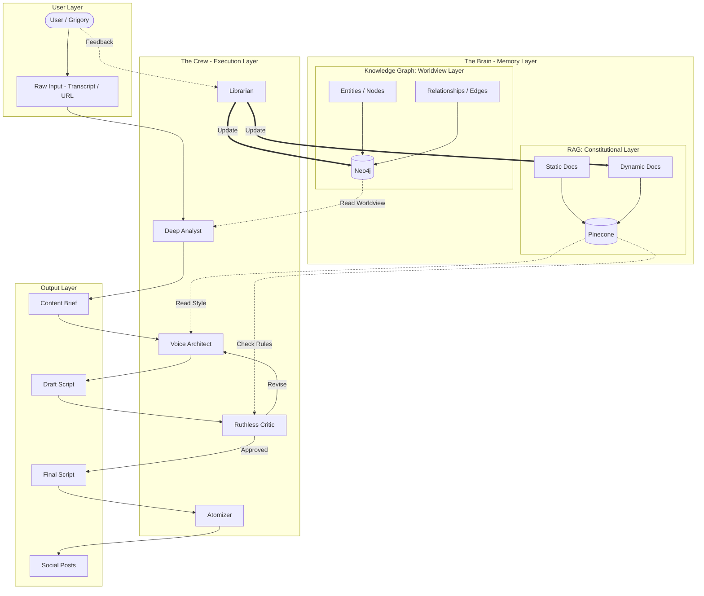

# Target Solution Architecture

## System Overview

The Pragmatic Content Factory (PCF) is an agent ecosystem designed to generate highly personalized and strategically aligned content for the "Pragmatic Architect" brand. The system prioritizes authenticity, engineering pragmatism, and alignment with brand DNA.

## Technology Stack

| Component | Technology | Purpose |
|-----------|------------|---------|
| Agent Framework | Google ADK | Orchestration and agent management |
| LLM | Gemini 2.5 Flash | Content generation and analysis |
| Vector Store | Pinecone | RAG Constitutional Layer |
| Graph Database | Neo4j | Knowledge Graph Worldview Layer |
| Data Validation | Pydantic | Type-safe data models |

## Architecture Diagram



## Data Flow

### Main Pipeline

```
Input → Deep Analyst → Voice Architect ↔ Ruthless Critic → Final Script → Atomizer → Social Posts
```

1. **Input Stage**: Raw content (transcripts, URLs, ideas) enters the system
2. **Analysis Stage**: Deep Analyst extracts key insights, pain points, and social currency
3. **Writing Stage**: Voice Architect generates drafts following brand style
4. **Quality Gate**: Ruthless Critic validates against RAG rules (iterative loop)
5. **Distribution Stage**: Atomizer creates platform-specific content

### Learning Loop

```
User Feedback → Librarian → RAG (Dynamic Docs) + Knowledge Graph
```

- User corrections have highest priority
- Taboo terms are immediately indexed for next cycle
- Worldview updates propagate to future content

## Memory Architecture

### RAG Constitutional Layer (Pinecone)

**Purpose**: Store and retrieve voice, tone, and style rules

**Static Documents** (Read-Only):
- `brand_passport.pdf` - Brand DNA and identity
- `reader_card.pdf` - Target audience profile
- `speech_code.pdf` - Linguistic patterns and vocabulary

**Dynamic Documents** (Librarian-Managed):
- `taboo_list.md` - Prohibited phrases and hype terms
- `style_adjustments.md` - Tone evolution log

### Knowledge Graph Worldview Layer (Neo4j)

**Purpose**: Store structured relationships between concepts and stances

**Node Types**:
- `Tool` - Technologies (LangChain, Docker, Kubernetes)
- `Concept` - Ideas (MLOps, Latency, Reproducibility)
- `Person` - Key figures (Grigory)
- `Problem` - Pain points (Debugging Nightmare, Hype)

**Relationship Types**:
- `causes` - Tool/Concept causes Problem
- `solves` - Tool solves Problem
- `hates` - Person dislikes Concept
- `prefers` - Person prefers Tool
- `skeptical_of` - Person is skeptical of Tool

**Example Relationships**:
```cypher
(LangChain)-[:CAUSES]->(DebuggingNightmare)
(Docker)-[:SOLVES]->(Reproducibility)
(Grigory)-[:HATES]->(Hype)
(Grigory)-[:PREFERS]->(PurePython)
```

## Agent Specifications

### 1. Deep Analyst (The Extractor)

**Input**: Raw ideas, transcripts, URLs
**Output**: Structured Content Brief
**Memory Access**: Knowledge Graph (read)

**Responsibilities**:
- Deconstruct raw input to identify key insights
- Map content to audience pain points
- Check existing worldview stance on mentioned tools
- Generate "Social Currency" angles

### 2. Voice Architect (The Ghostwriter)

**Input**: Content Brief
**Output**: Draft Script
**Memory Access**: RAG (read)

**Responsibilities**:
- Generate content following brand voice
- Apply dramaturgical formulas
- Mix technical jargon with accessible language
- Maintain "Confident Pragmatist" tone

### 3. Ruthless Critic (The Quality Gate)

**Input**: Draft Script
**Output**: Critique with Pass/Fail
**Memory Access**: RAG (read)

**Metrics Evaluated**:
- **Tonal Score**: Alignment with brand voice
- **Hype-Level**: Absence of buzzwords and empty promises
- **Emoji Check**: Only functional emojis (⬇️, →), no emotional ones
- **Transformation Language**: Use of concrete outcomes

### 4. Atomizer (The Distributor)

**Input**: Approved Final Script
**Output**: Platform-specific content
**Memory Access**: None

**Outputs Generated**:
- 50 headline variants for YouTube/Reels
- LinkedIn post structure
- Editing sheets with timestamps
- Short-form content snippets

### 5. Librarian (Memory Manager)

**Input**: User feedback and corrections
**Output**: Updated RAG/KG entries
**Memory Access**: RAG (write), KG (write)

**Responsibilities**:
- Process feedback with priority ranking
- Update taboo list immediately
- Add new tool/stance relationships to graph
- Log style adjustments over time

## Configuration

### Environment Variables

```bash
# Pinecone
PINECONE_API_KEY=xxx
PINECONE_ENVIRONMENT=xxx
PINECONE_INDEX_NAME=pcf-constitutional

# Neo4j
NEO4J_URI=bolt://localhost:7687
NEO4J_USER=neo4j
NEO4J_PASSWORD=xxx

# LLM
GOOGLE_API_KEY=xxx

# Optional
OPENAI_API_KEY=xxx  # For embeddings alternative
```

## Deployment Considerations

1. **Pinecone Index**: Create index with 1536 dimensions (OpenAI embeddings) or 768 (Gemini)
2. **Neo4j Instance**: Can use Neo4j Aura (cloud) or local Docker instance
3. **Document Ingestion**: Initial indexing of static documents required before first run
4. **Graph Seeding**: Pre-populate knowledge graph with core worldview relationships
