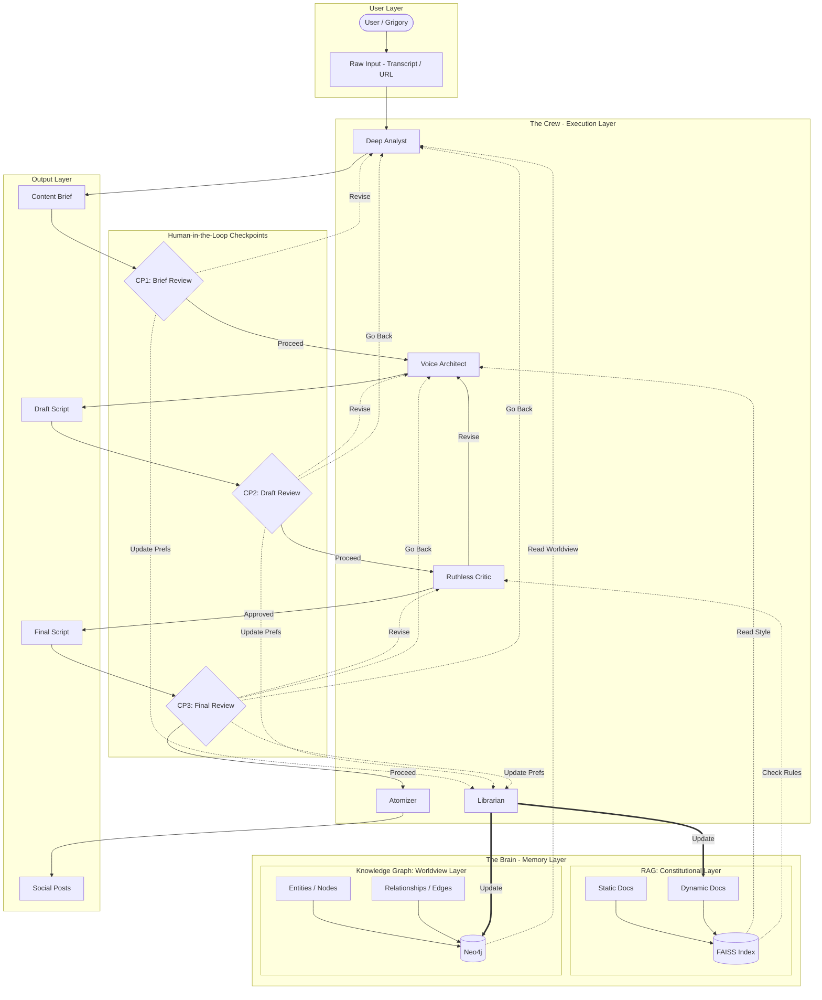

# Target Solution Architecture

## System Overview

The Pragmatic Content Factory (PCF) is an agent ecosystem designed to generate highly personalized and strategically aligned content for the "Pragmatic Architect" brand. The system prioritizes authenticity, engineering pragmatism, and alignment with brand DNA.

## Technology Stack

| Component | Technology | Purpose |
|-----------|------------|---------|
| Agent Framework | Google ADK | Orchestration and agent management |
| LLM | Gemini 2.5 Flash | Content generation and analysis |
| Vector Store | FAISS (local, disk-persisted) | RAG Constitutional Layer |
| Graph Database | Neo4j (Docker, volume-persisted) | Knowledge Graph Worldview Layer |
| Data Validation | Pydantic | Type-safe data models |

## Architecture Diagram



## Data Flow

### Main Pipeline with Checkpoints

```
Input → Analyst → Brief → [CP1] → Writer → Draft → [CP2] → Critic ↔ Writer → Final → [CP3] → Atomizer → Social
                    ↑               ↑                                   ↑
                    └───────────────┴───────── Go Back ─────────────────┘
```

1. **Input Stage**: Raw content (transcripts, URLs, ideas) enters the system
2. **Analysis Stage**: Deep Analyst extracts key insights, pain points, and social currency
3. **Checkpoint 1 (Brief Review)**: User reviews Content Brief
4. **Writing Stage**: Voice Architect generates drafts following brand style
5. **Checkpoint 2 (Draft Review)**: User reviews Draft Script
6. **Quality Gate**: Ruthless Critic validates against RAG rules (iterative loop)
7. **Checkpoint 3 (Final Review)**: User reviews approved Final Script
8. **Distribution Stage**: Atomizer creates platform-specific content

### Checkpoint Actions

At each checkpoint, the user can:

| Action | Description | Next State |
|--------|-------------|------------|
| **Proceed** | Approve and continue | Next stage |
| **Revise** | Re-run current stage with feedback | Same stage |
| **Go Back** | Return to earlier stage | Previous stage(s) |
| **Update Preferences** | Invoke Librarian first | Librarian → Revise/Go Back |

### Go Back Navigation

| From Checkpoint | Can Go Back To |
|-----------------|----------------|
| CP1 (Brief) | — (first stage) |
| CP2 (Draft) | Analyst |
| CP3 (Final) | Writer, Analyst |

**Note**: Going back invalidates all downstream artifacts. Going from CP3 to Analyst will require re-running Analyst → Writer → Critic.

### Learning Loop

```
User Feedback (at any checkpoint) → Librarian → RAG (Dynamic Docs) + Knowledge Graph
```

- User corrections have highest priority
- Taboo terms are immediately indexed for next cycle
- Worldview updates propagate to future content
- **In-flow updates**: Checkpoint-triggered updates affect the current run (not just future runs)

## Memory Architecture

### RAG Constitutional Layer (FAISS)

**Purpose**: Store and retrieve voice, tone, and style rules

**Storage**: Local FAISS index persisted to `data/faiss_index/` directory

**Static Documents** (Read-Only):
- `brand_passport.pdf` - Brand DNA and identity
- `reader_card.pdf` - Target audience profile
- `speech_code.pdf` - Linguistic patterns and vocabulary

**Dynamic Documents** (Librarian-Managed):
- `taboo_list.md` - Prohibited phrases and hype terms
- `style_adjustments.md` - Tone evolution log

### Knowledge Graph Worldview Layer (Neo4j)

**Purpose**: Store structured relationships between concepts and stances

**Storage**: Local Docker container with data persisted to `data/neo4j_data/` directory

**Node Types**:
- `Tool` - Technologies (LangChain, Docker, Kubernetes)
- `Concept` - Ideas (MLOps, Latency, Reproducibility)
- `Person` - Key figures (Grigory)
- `Problem` - Pain points (Debugging Nightmare, Hype)

**Relationship Types**:
- `causes` - Tool/Concept causes Problem
- `solves` - Tool solves Problem
- `hates` - Person dislikes Concept
- `prefers` - Person prefers Tool
- `skeptical_of` - Person is skeptical of Tool

**Example Relationships**:
```cypher
(LangChain)-[:CAUSES]->(DebuggingNightmare)
(Docker)-[:SOLVES]->(Reproducibility)
(Grigory)-[:HATES]->(Hype)
(Grigory)-[:PREFERS]->(PurePython)
```

## Workflow State Management

The checkpoint pattern requires tracking workflow state to support navigation and re-runs.

### State Model

```python
class WorkflowState:
    # Current position in pipeline
    current_stage: Stage  # ANALYZING, WRITING, CRITIQUING, ATOMIZING
    
    # Artifacts from completed stages (needed for go-back)
    input: RawInput
    brief: Optional[ContentBrief] = None
    draft: Optional[DraftScript] = None
    final: Optional[FinalScript] = None
    
    # Iteration tracking (prevent infinite loops)
    stage_attempts: Dict[Stage, int]  # Max 3 per stage
    
    # Accumulated feedback context
    feedback_history: List[StageFeedback]
    
    # Audit trail
    transitions: List[StateTransition]
```

### Stage Transitions

```python
class StateTransition:
    from_stage: Stage
    to_stage: Stage
    action: Action  # PROCEED, REVISE, GO_BACK, UPDATE_PREFS
    user_feedback: Optional[str]
    preferences_updated: bool
    timestamp: datetime
```

### Artifact Invalidation

When going back, downstream artifacts become stale:

| Go Back To | Invalidated Artifacts |
|------------|----------------------|
| Analyst | Brief, Draft, Final |
| Writer | Draft, Final |
| Critic | Final |

### Context Propagation

When re-running a stage (via Revise or Go Back), the agent receives:
1. Original input for that stage
2. Previous output (if Revise)
3. User feedback explaining what to change
4. Accumulated feedback from later stages (if Go Back)

This allows earlier stages to benefit from insights discovered later in the pipeline.

## Agent Specifications

### 1. Deep Analyst (The Extractor)

**Input**: Raw ideas, transcripts, URLs
**Output**: Structured Content Brief
**Memory Access**: Knowledge Graph (read)

**Responsibilities**:
- Deconstruct raw input to identify key insights
- Map content to audience pain points
- Check existing worldview stance on mentioned tools
- Generate "Social Currency" angles

### 2. Voice Architect (The Ghostwriter)

**Input**: Content Brief
**Output**: Draft Script
**Memory Access**: RAG (read)

**Responsibilities**:
- Generate content following brand voice
- Apply dramaturgical formulas
- Mix technical jargon with accessible language
- Maintain "Confident Pragmatist" tone

### 3. Ruthless Critic (The Quality Gate)

**Input**: Draft Script
**Output**: Critique with Pass/Fail
**Memory Access**: RAG (read)

**Metrics Evaluated**:
- **Tonal Score**: Alignment with brand voice
- **Hype-Level**: Absence of buzzwords and empty promises
- **Emoji Check**: Only functional emojis (⬇️, →), no emotional ones
- **Transformation Language**: Use of concrete outcomes

### 4. Atomizer (The Distributor)

**Input**: Approved Final Script
**Output**: Platform-specific content
**Memory Access**: None

**Outputs Generated**:
- 50 headline variants for YouTube/Reels
- LinkedIn post structure
- Editing sheets with timestamps
- Short-form content snippets

### 5. Librarian (Memory Manager)

**Input**: User feedback and corrections (from any checkpoint)
**Output**: Updated RAG/KG entries
**Memory Access**: RAG (write), KG (write)

**Invocation Points**:
- CP1 (Brief Review): User selects "Update Preferences"
- CP2 (Draft Review): User selects "Update Preferences"
- CP3 (Final Review): User selects "Update Preferences"

**Responsibilities**:
- Process feedback with priority ranking
- Update taboo list immediately
- Add new tool/stance relationships to graph
- Log style adjustments over time
- **In-flow updates**: Apply preference changes that affect current content run

## Configuration

### Environment Variables

```bash
# FAISS (local vector store)
FAISS_INDEX_PATH=data/faiss_index  # Directory for persisted index
FAISS_INDEX_NAME=pcf-constitutional  # Index file name

# Neo4j
NEO4J_URI=bolt://localhost:7687
NEO4J_USER=neo4j
NEO4J_PASSWORD=xxx

# LLM
GOOGLE_API_KEY=xxx

# Optional
OPENAI_API_KEY=xxx  # For embeddings alternative
```

### Docker Compose

Neo4j runs as a local Docker container with volume persistence:

```yaml
# docker-compose.yml
services:
  neo4j:
    image: neo4j:5-community
    container_name: pcf-neo4j
    ports:
      - "7474:7474"  # HTTP browser (http://localhost:7474)
      - "7687:7687"  # Bolt protocol
    volumes:
      - ./data/neo4j_data:/data
      - ./data/neo4j_logs:/logs
    environment:
      - NEO4J_AUTH=neo4j/${NEO4J_PASSWORD:-password}
    restart: unless-stopped
```

**Usage**:
- Start: `docker-compose up -d`
- Stop: `docker-compose down`
- View logs: `docker-compose logs -f neo4j`
- Browser UI: http://localhost:7474

## Deployment Considerations

1. **FAISS Index**: 
   - Local index stored in `data/faiss_index/` directory
   - Supports 1536 dimensions (OpenAI embeddings) or 768 (Gemini)
   - Index is automatically persisted to disk after updates using `faiss.write_index()`
   - Loaded on startup using `faiss.read_index()` if exists, otherwise created fresh
2. **Neo4j Instance**: 
   - Local Docker container (see `docker-compose.yml`)
   - Data persisted to `data/neo4j_data/` via volume mount
   - Survives container restarts and recreations
   - Start with `docker-compose up -d` before running the application
3. **Document Ingestion**: Initial indexing of static documents required before first run
4. **Graph Seeding**: Pre-populate knowledge graph with core worldview relationships
5. **FAISS Persistence**: The index directory should be included in backups; exclude from `.gitignore` only the index files, not the directory structure
